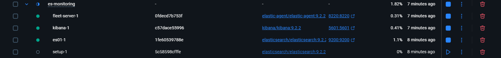
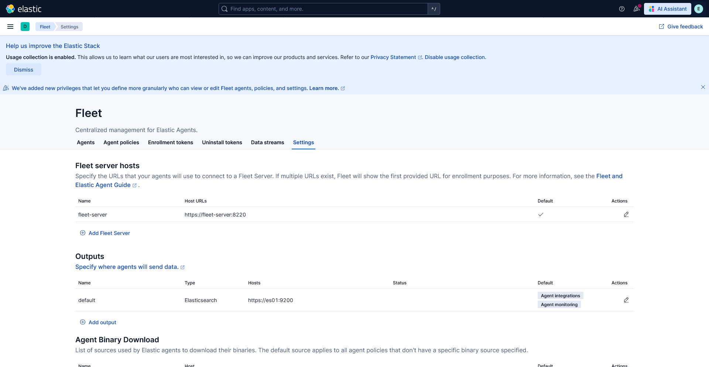
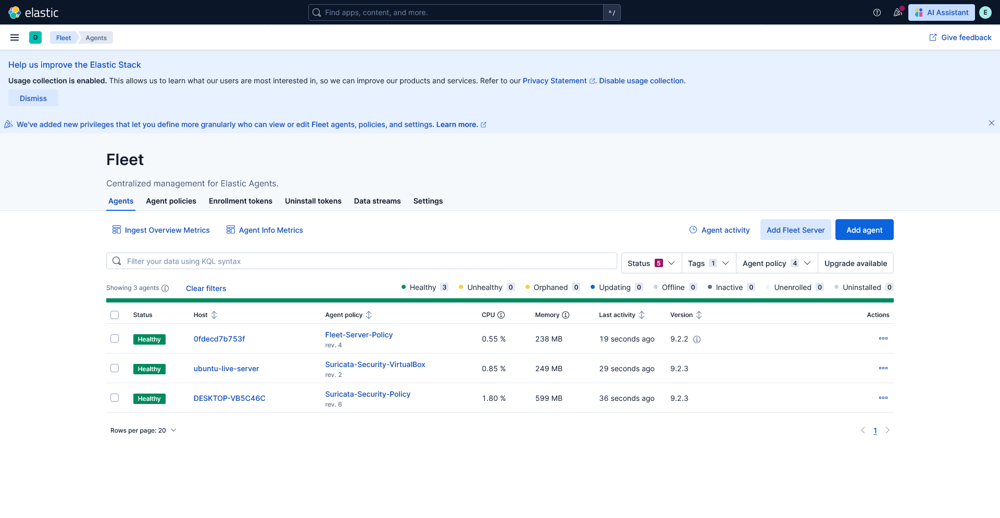
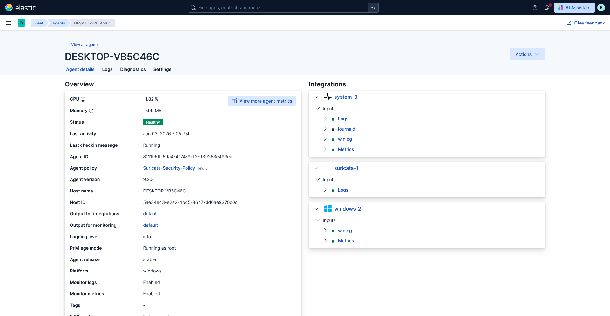
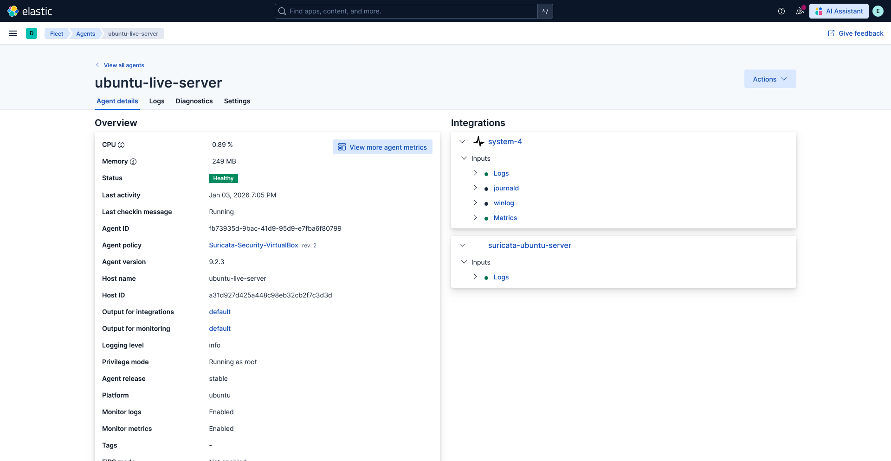
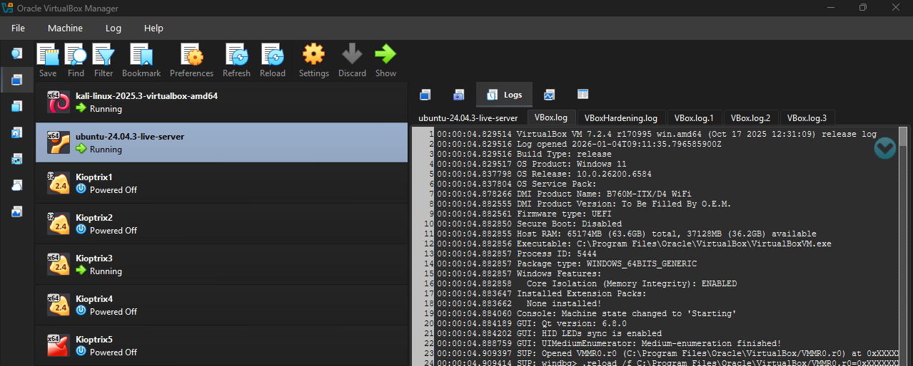
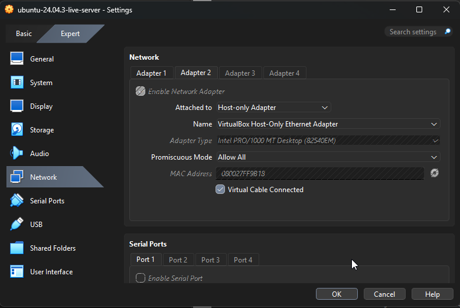
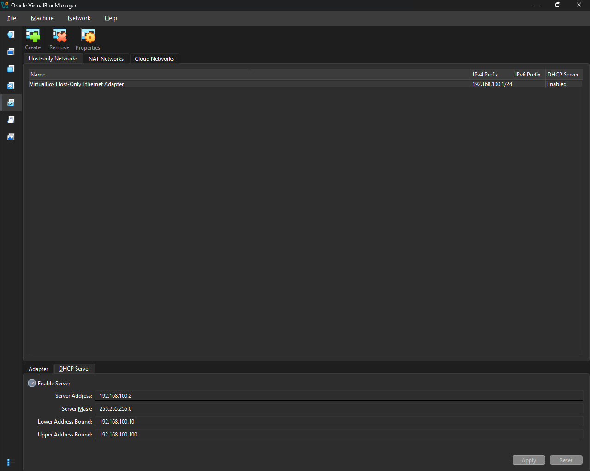
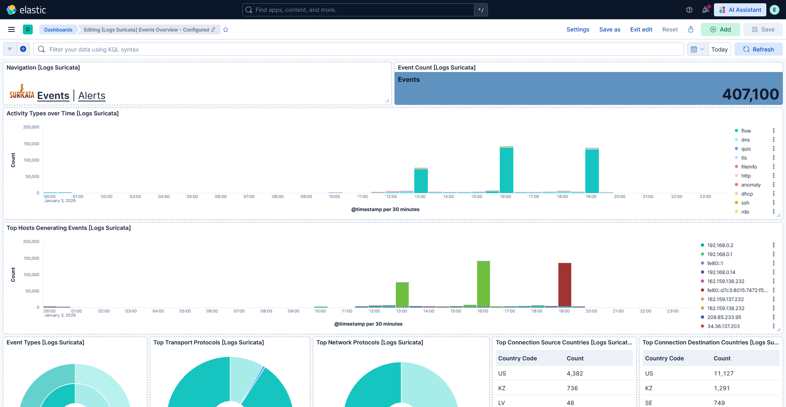
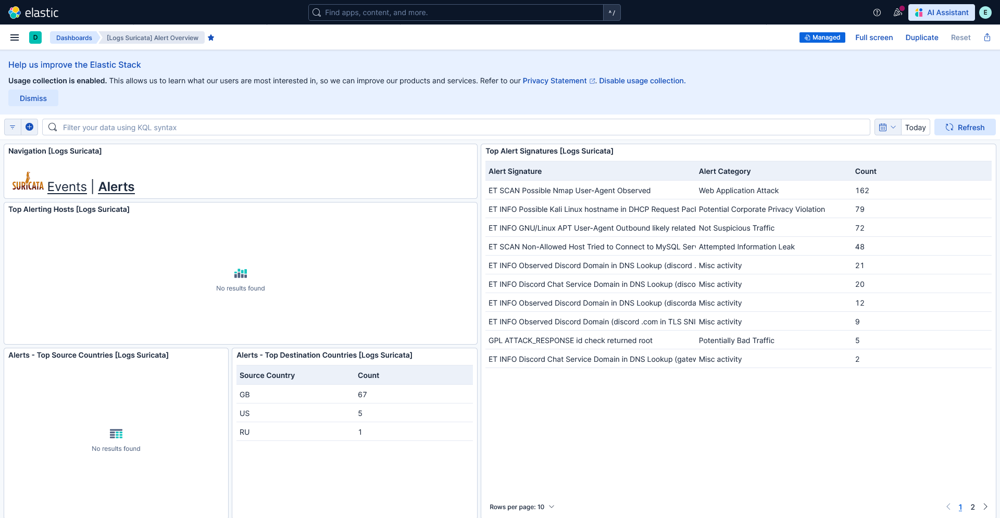

# :microscope: ELK Stack v9.2.2 & Suricata IDS Home Lab

## Обзор проекта
В этом репозитории собраны конфигурационные файлы ELK (Docker) и методические материалы по развертыванию моей домашней SIEM-лаборатории. Проект демонстрирует процесс интеграции сетевого IDS-сенсора и мониторинга конечных точек в единую систему анализа логов.

> При создании проекта я опирался на архитектурные принципы, описанные в руководстве **elkninja / elastic-stack-docker-part-two**, адаптировав их под актуальную версию 9.2.2.

### Что включено в этот репозиторий

Я выложил только те части кода, которые были кастомизированы для работы лаборатории:

* docker-compose.yml, kibana.yml, .env — настроенный стек v9.2.2.
* Методология: Описание процесса интеграции компонентов.

### Архитектурное решение:
* **Ядро системы (Docker):** Elasticsearch, Kibana и Fleet Server развернуты в контейнерах для обеспечения модульности и быстрого обновления.
* **Сенсор IDS (Native Windows):** Suricata установлена напрямую на хостовую ОС, что позволяет прямое взаимодействие с сетевым интерфейсом через **Npcap**. Данное решение гарантирует захват трафика без потерь и конфликтов с виртуальными сетями Docker.
* **Гибридная среда VirtualBox:**
    * **Kali Linux:** Основной инструмент для проведения атак и тестирования сигнатур.
    * **Ubuntu Server:** Дополнительный узел мониторинга с установленным **Suricata** и **Elastic Agent**.
    * **VulnHub VMs:** Уязвимые машины, используемые в качестве целей для отработки навыков детектирования реальных эксплойтов.

### Технологический стек

**1. SIEM Core (Containerized)**

> Центральный узел обработки и визуализации данных, развернутый в изолированной среде:

* Elastic Stack v9.2.2 (Docker): Elasticsearch для хранения индексов и Kibana для аналитики.
* Fleet Server: Управление жизненным циклом агентов и политиками сбора данных.
* Docker Desktop: Среда оркестрации контейнеров SIEM-ядра.

**2. Detection & Monitoring Layer (Host & Agents)**

> Компоненты, отвечающие за обнаружение угроз на уровне сетевого трафика и конечных точек:

* Suricata IDS:

    * Windows Native: Установка на основной системе для прямого доступа к сетевому интерфейсу (через Npcap) и анализа трафика VirtualBox.
    * Ubuntu Server: Дополнительный сенсор внутри виртуальной сети.

* ET Open Ruleset: Набор правил от Emerging Threats для сигнатурного анализа.
* Elastic Agent (Fleet-managed): Агенты для сбора системных логов и событий eve.json от Suricata.

**3. Attack & Lab Environment (Virtualization)**
> Изолированная среда для генерации трафика и тестирования эксплойтов:

* VirtualBox: Гипервизор для запуска лабораторных стендов.
* Kali Linux: Инструментарий для проведения пентестов.
* VulnHub Target Machines: Целевые уязвимые системы.
* Ubuntu 22.04 LTS: Вспомогательный серверный узел.

---

### Пошаговое руководство

1. Подготовка SIEM (Docker)

    * Запустить стек: docker-compose up -d.
    * В интерфейсе Kibana активировать Fleet Server и создать политики сбора данных (подробнее у elkninja и Evermight Systems youtube chanel).
  

  

  

2. Настройка сенсора (Windows Host)

    * Установить Suricata и Npcap на основную систему (подробнее у Hacker Sploit youtube chanel и в официальной документации suricata).
    * Подключить ET Open ruleset для актуальных сигнатур.
    * Убедиться, что логи пишутся в формате eve.json (папка C:\Program Files\Suricata\log).
    * Установить Elastic Agent на Windows, привязав их к Fleet Server.
  

  

> Я установил интеграцию Windows и Suricata.

  

4. Инфраструктура VirtualBox

    * Настроить Host-only Network в VirtualBox. Добавить DHCP Server.
    * Установить Kali Linux и Ubuntu Server. Настроить сетевые адаптеры машин (Kali, Ubuntu) в режим Bridged mode и Host-only Network с включенным Promiscuous Mode, чтобы Suricata видела их трафик.
    * Установить Elastic Agent на Ubuntu, привязав их к Fleet Server.
    * Установить уязвимые виртуальные машины с Vulnhub. Настроить их сетевой адаптер в режим Network на Host-only Network с включенным Promiscuous Mode.

  

  

  

  

6. Аналитика и Тесты

    * Провести сканирование (например, nmap) с Kali Linux на уязвимую машину.
    * Проверить появление алертов в Kibana.
    * Настроить Dashboards для визуализации инцидентов.

  

  

